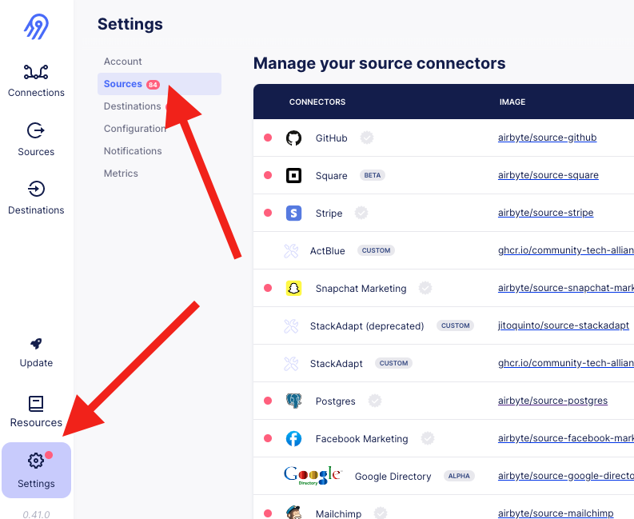

# [HOW TO] Low-Code Airbyte Source Development

# Overview

Airbyte recently(?) released a new tool for developing custom source integrations. Basically all you have to do is fill out a configuration YAML with the details for your API, and the `YamlDeclarativeSource` class parses it and spins out the connector for you. It’s pretty neat!

# Steps

Official Airbyte documentation is here: [Low-code CDK Overview](https://docs.airbyte.com/connector-development/config-based/low-code-cdk-overview/) 

But obviously I prefer my own documentation, see below:

## Initialize a new Github repository

1. Create an empty Github repository. Make it public.
2. Copy in the files from a different YamlDeclarativeSource (such as `empower`)
3. Find-and-replace `empower` => `your_new_source_name`
4. Replace the contents of manifest.yaml

## Fill out the config YAML

1. Navigate to `/connector-builder` (manually add that to the URL for the webserver - it's real, I promise!)
2. Follow the steps in the UI for configuring your new connector
3. For each stream:
    1. Set up the connection
    2. Click “Test”
    3. Click “Detected schema” - this might ask you if you want to update a blank schema with the detected schema, which you do. It should look something like this:


4. Download the config YAML by navigating to the lower-left corner of the screen:


5. Replace the contents of `manifest.yaml` with the config you just exported. Neat!


## Testing and Deployment

This procedure is the same as it’s ever been, but worth re-documenting here:


### Test Locally

1. In the Terminal, cd into `source-my-new-connector` (the new repository you just created)
2. Create a secrets/config.json file containing any required fields in the connector spec. This will look something like:

```
{
 "api_key": "foo"
}
```
3. MAKE SURE THIS FILE IS IGNORED BY GITHUB! We don’t love pushing secrets to Github!
4. In your terminal, you can run `docker` commands to test your new source connector locally:

```
docker run --rm ghcr.io/community-tech-alliance/source-empower:0.0.2 spec

docker run --rm -v $(pwd)/secrets:/secrets ghcr.io/community-tech-alliance/source-empower:0.0.2 check --config /secrets/config.json

docker run --rm -v $(pwd)/secrets:/secrets ghcr.io/community-tech-alliance/source-empower:0.0.2 discover --config /secrets/config.json

docker run --rm -v $(pwd)/secrets:/secrets -v $(pwd)/integration_tests:/integration_tests ghcr.io/community-tech-alliance/source-empower:0.0.2 read --config /secrets/config.json --catalog /integration_tests/configured_catalog.json

```

5. If your connector is running successfully, time to deploy it to the Internet!


### Deploy to Github Container Registry

1. Fire up Docker on your machine
2. In the Terminal, cd into `source-my-new-connector` (the new repository you just created)
3. Build an image with a tag that will link it to Github Container Registry:

```docker build . -t ghcr.io/community-tech-alliance/source-my-new-connector:dev```

4. Push that image to GHCR:

```docker push ghcr.io/community-tech-alliance/source-my-new-connector:dev```

5. Go to `Packages` in Github and find the image you just pushed. Once you have found it:
    1. Link the package to your new repository
    2. Change visibility to `Public` - this is necessary for Airbyte to download the image.

### Test the New Source in Airbyte

1. In the Airbyte web server, go to “Settings” and then “Sources”:



2. Fill out the details for your the source connector you just deployed:


3. Create a Source in Airbyte using your new connector
4. Create a Connection using your new Source and the default BigQuery destination
5. Try running the sync
6. 🙏